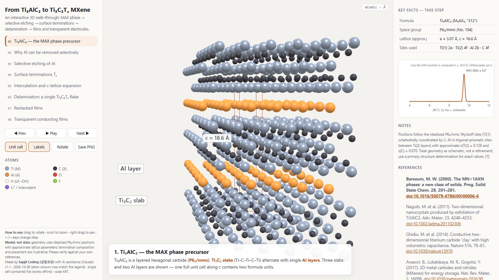

# MXene in 3D — from Ti₃AlC₂ to Ti₃C₂Tₓ

**An interactive, offline, single-file 3D explainer of how the most-studied MXene is made.**
Rotate the crystal, etch out the aluminium, watch terminations cap the surface, and peel off a ~1 nm sheet.

▶ **Open it:** https://songt-50.github.io/mxene-3d/ (or download `index.html` and double-click — no internet needed)

### New (2026-10-10): the bottom-up route — vapor-phase synthesis of Ti₂CCl₂
▶ **Open it:** https://songt-50.github.io/mxene-3d/vapor.html (or download `vapor.html`)

Nine steps based on Kim *et al.*, *J. Am. Chem. Soc.* 2026, [doi:10.1021/jacs.6c10774](https://doi.org/10.1021/jacs.6c10774) (CC-BY 4.0; all graphics redrawn):
1. **The vapor-growth experiment** — Ti, TiCl₄ and CH₄ in a tube furnace
2. **Change the Ti loading, change the growth** — crucible, carrier tube + quartz, Ti on the carrier wall, and the unconfined control
3. **Confinement builds up TiCl₂ next to the Ti** — Ti + TiCl₄ → 2 TiCl₂ (net)
4. **Crossing the nucleation threshold** — incubation Ti film vs. MXene nucleation (proposed mechanism)
5. **A nucleus grows by edge addition** — 2 TiCl₂ + CH₄ → Ti₂CCl₂ + 2 HCl + H₂ (proposed mechanism)
6. **The crystal** — Cl–Ti–C–Ti–Cl; a ≈ 3.20 Å and d ≈ 8.4 Å computed from the reported XRD peaks
7. **Lamellae organise into spherulites** — ~300 nm (2 h) and 2–3 µm (24 h) at 950 °C
8. **Merging, filling — and the TiC limit**
9. **Toward larger single crystals** — the stated future target, not a reported result

Sources: `src-vapor/` → `python build_vapor.py`. References: `REFERENCES-vapor.md` (8/8 checked against Crossref/OpenAlex). Checks: two independent AI review passes on the science (Claude critic, OpenAI Codex) and two Codex passes on the storyline; all findings were checked against the paper text before being applied.

**Correction (v1.2, 2026-10-10) to the Ti₃AlC₂ explainer:** the in-plane positions of the B/C close-packed sites used 120°-basis fractions with a 60° Cartesian basis, so atoms sat off the hollow sites (nearest in-plane offset 0.333a instead of 0.577a). Fixed in `src/app.js`; found by the Codex review of the new explainer, which reuses the same code.

## The 8 steps
1. **Ti₃AlC₂ MAX phase** — P6₃/mmc, Ti₃C₂ slabs + Al layers, unit cell shown
2. **Why Al leaves** — strong Ti–C vs. weaker Ti–Al bonding
3. **Selective etching** — HF or LiF + HCl, with the idealized reaction
4. **Surface terminations Tₓ** — –O, –OH, –F
5. **Intercalation** — Li⁺/H₂O or organic molecules; (002) peak shifts to lower 2θ
6. **Delamination** — one Ti₃C₂Tₓ flake, five atomic planes
7. **Restacked films** — in-flake metallic transport, flake-to-flake junctions
8. **Transparent conducting films** — the transmittance vs. sheet-resistance trade-off

Each step has a key-facts panel, equations, a schematic chart and numbered references (DOIs linked). Buttons: unit cell, labels, auto-rotate, **Save PNG** (for slides).

## How it was made
- **Built with an AI assistant (Claude)** by Sapjil Coding (삽질코딩), a Korean channel about building things with code and AI.
- **Rendering:** plain [three.js](https://threejs.org) (r147, MIT), inlined so the whole thing is one HTML file. No build tools, no server, no tracking.
- **Structure:** atoms are placed on the idealized P6₃/mmc Wyckoff sites of Ti₃AlC₂ — Ti(1) 2a, Ti(2) 4f, Al 2b, C 4f — with approximate a ≈ 3.07 Å, c ≈ 18.6 Å. The (002) position (≈ 9.5°, Cu Kα) is computed from *c*; other peak positions are illustrative.
- **Checks we ran before publishing:**
  - every reference was checked against Crossref/OpenAlex (exists · title · first author · volume · pages) — 10/10;
  - two independent AI review passes on the science. The first caught a real error — the two halves of each slab were placed on the same in-plane site, which drew Ti(1) as trigonal-prismatic and Al as octahedral. It was fixed using the inversion symmetry of 4f, so Ti(1) is now octahedral and Al trigonal-prismatic. The second pass caught a citation that did not support its sentence, and it was corrected.

## Honest limits
This is a teaching model, not a structure refinement. Lattice parameters and z-coordinates are approximate. The O/OH/F mix and placement are illustrative. Gaps between layers are exaggerated for visibility. Flake sizes and film views are schematic.

## Changes
- **v1.1 (2026-10-08)** — atom colours in the 3D view now match the legend. three.js r147 was treating the legend hex colours as linear values, so every atom rendered paler (Al orange looked pale yellow, C near-black looked mid-grey). Fixed by turning on three.js colour management; no geometry or text changed.

## Source
`src/app.js` (scene + content) and `src/template.html` (layout) → `python build.py` → `index.html`.
Code: MIT. References: see [REFERENCES.md](REFERENCES.md).

## License

MIT — see [LICENSE](LICENSE).

Third-party: three.js (vendor/three.min.js, vendor/OrbitControls.js) is © 2010-2022 three.js authors, MIT License. Its copyright notice is kept at the top of `vendor/three.min.js` and inside `index.html`.
